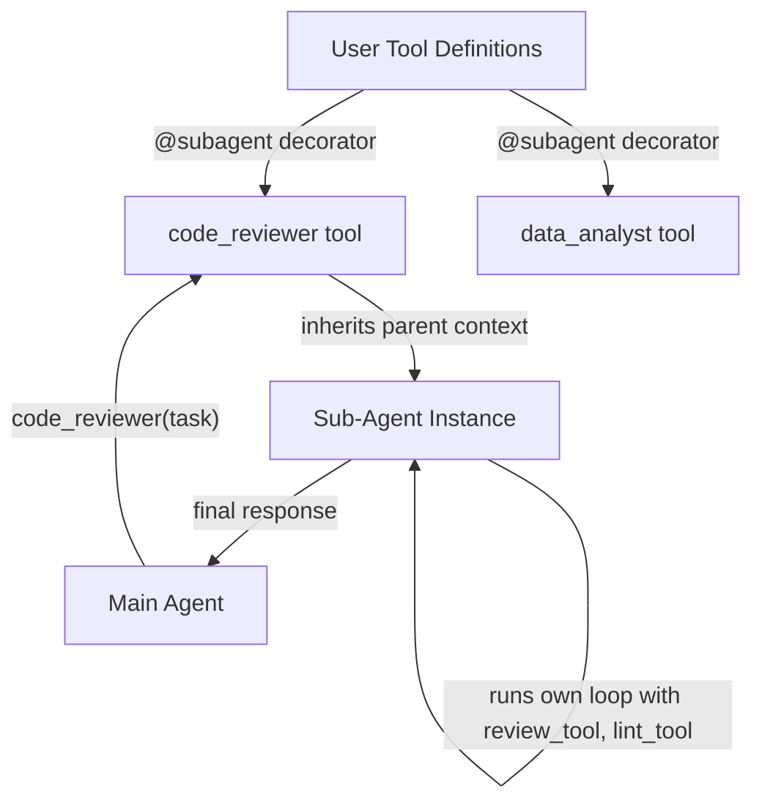

# Multi-Agent Architecture for CAL

## Architecture Overview



## User-Facing API

Users define subagent tools in their tool definition files:

```python
from CAL import subagent, tool

# Regular tools the subagent can use
@tool
async def review_file(path: str):
    """Review a single file for issues."""
    # ... implementation
    return {"content": [{"type": "text", "text": "..."}], "metadata": {}}

@tool
async def run_linter(path: str):
    """Run linter on a file."""
    return {"content": [{"type": "text", "text": "..."}], "metadata": {}}

# Define a subagent as its own tool
@subagent(
    system_prompt="You are a code reviewer. Analyze code for bugs and style issues.",
    tools=[review_file, run_linter],
    max_calls=5
)
async def code_reviewer(task: str):
    """Delegate code review tasks to a specialized sub-agent."""
    pass  # Body unused - decorator handles execution
```

Then register with the main agent:

```python
agent = Agent(llm=llm, tools=[code_reviewer, other_tools...], ...)
```

When the LLM calls `code_reviewer(task="Review the auth module")`, the subagent:

1. Receives parent's full conversation history
2. Runs its own agentic loop with `review_file` and `run_linter` tools
3. Returns final response to the main agent

## Implementation

### 1. Add SubAgentTool class to [src/CAL/tool.py](src/CAL/tool.py)

```python
class SubAgentTool(Tool):
    """A tool that spawns a sub-agent to handle delegated tasks."""

    def __init__(
        self,
        name: str,
        description: str,
        system_prompt: str,
        tools: List[Tool],
        max_calls: int = 10,
    ):
        self.name = name
        self.description = description
        self.system_prompt = system_prompt
        self.sub_tools = tools
        self.sub_max_calls = max_calls
        self._parent_agent = None  # Set at runtime by Agent
        self.input_schema = {
            "type": "object",
            "properties": {"task": {"type": "string"}},
            "required": ["task"]
        }

    def bind_parent(self, parent_agent: 'Agent'):
        """Bind to parent agent for context access."""
        self._parent_agent = parent_agent

    async def execute(self, task: str, **kwargs) -> ToolResultBlock:
        # 1. Clone parent's memory (full history)
        # 2. Create sub-agent with self.sub_tools and self.system_prompt
        # 3. Run sub_agent.run_async(task)
        # 4. Extract and return final response
```

### 2. Add subagent decorator to [src/CAL/tool.py](src/CAL/tool.py)

```python
def subagent(
    system_prompt: str,
    tools: List[Tool],
    max_calls: int = 10
):
    """
    Decorator to define a sub-agent as a tool.

    Example:
        @subagent(
            system_prompt="You are a code reviewer...",
            tools=[review_tool, lint_tool]
        )
        async def code_reviewer(task: str):
            '''Reviews code for issues.'''
            pass
    """
    def decorator(func):
        return SubAgentTool(
            name=func.__name__,
            description=inspect.getdoc(func) or "",
            system_prompt=system_prompt,
            tools=tools,
            max_calls=max_calls,
        )
    return decorator
```

### 3. Modify Agent to bind subagent tools in [src/CAL/agent.py](src/CAL/agent.py)

In `Agent.__init__`, bind any `SubAgentTool` instances to self:

```python
for tool in self.tools:
    if isinstance(tool, SubAgentTool):
        tool.bind_parent(self)
```

### 4. Add clone() to FullCompressionMemory in [src/CAL/memory.py](src/CAL/memory.py)

```python
def clone(self) -> 'FullCompressionMemory':
    """Create a deep copy of this memory."""
    return FullCompressionMemory(
        max_items=self.max_items,
        messages=list(self._messages)
    )
```

## Nesting Support

Sub-agents can spawn their own sub-agents by including subagent tools in their `tools` list:

```python
	@subagent(system_prompt="...", tools=[basic_tool])
async def inner_agent(task: str):
    pass

@subagent(system_prompt="...", tools=[inner_agent, other_tool])
async def outer_agent(task: str):
    pass
```

## Files to Modify

- [src/CAL/tool.py](src/CAL/tool.py) - Add `SubAgentTool` class and `subagent` decorator
- [src/CAL/agent.py](src/CAL/agent.py) - Bind subagent tools to parent in `__init__`
- [src/CAL/memory.py](src/CAL/memory.py) - Add `clone()` method
- [src/CAL/**init**.py](src/CAL/__init__.py) - Export `subagent` and `SubAgentTool`
